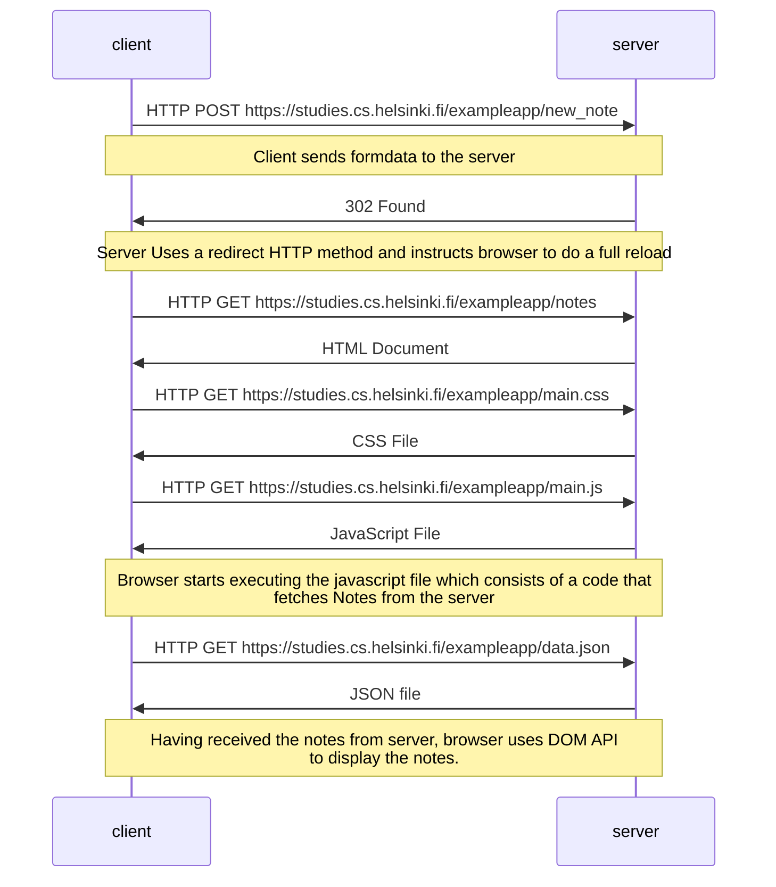

```mermaid
sequenceDiagram
client->>server: HTTP POST https://studies.cs.helsinki.fi/exampleapp/new_note 
Note over client,server: Client sends formdata to the server 
server->>client: 302 Found
Note over client,server: Server Uses a redirect HTTP method and instructs browser to do a full reload
client->>server : HTTP GET https://studies.cs.helsinki.fi/exampleapp/notes
server->>client: HTML Document
client->>server: HTTP GET https://studies.cs.helsinki.fi/exampleapp/main.css
server->>client: CSS File
client->>server: HTTP GET https://studies.cs.helsinki.fi/exampleapp/main.js
server->>client: JavaScript File
Note over client,server: Browser starts executing the javascript file which consists of a code that <br/> fetches Notes from the server
client->>server: HTTP GET https://studies.cs.helsinki.fi/exampleapp/data.json
server->>client: JSON file
Note over client,server: Having received the notes from server, browser uses DOM API <br/> to display the notes.
```