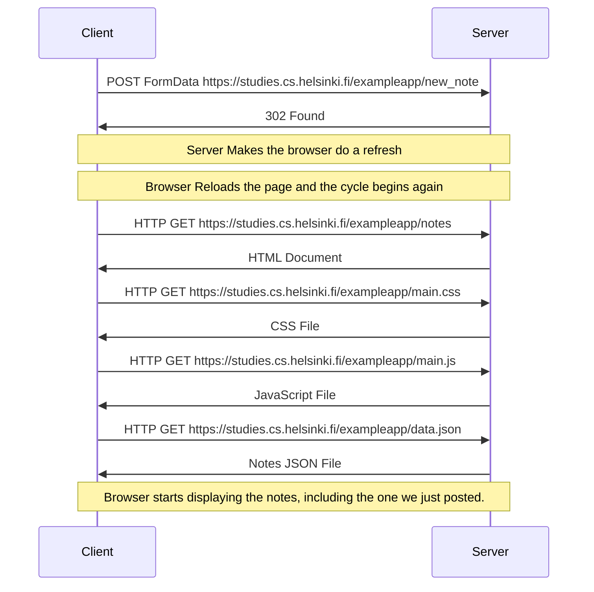

```mermaid
sequenceDiagram
Client->>Server:POST FormData https://studies.cs.helsinki.fi/exampleapp/new_note
Server->>Client: 302 Found
Note over Client,Server: Server Makes the browser do a refresh
Note over Client,Server: Browser Reloads the page and the cycle begins again
Client->>Server: HTTP GET https://studies.cs.helsinki.fi/exampleapp/notes
Server->>Client: HTML Document
Client->>Server: HTTP GET https://studies.cs.helsinki.fi/exampleapp/main.css
Server->>Client: CSS File
Client->>Server: HTTP GET https://studies.cs.helsinki.fi/exampleapp/main.js
Server->>Client: JavaScript File
Client->>Server: HTTP GET https://studies.cs.helsinki.fi/exampleapp/data.json
Server->>Client: Notes JSON File
Note over Client,Server: Browser starts displaying the notes, including the one we just posted.
```
