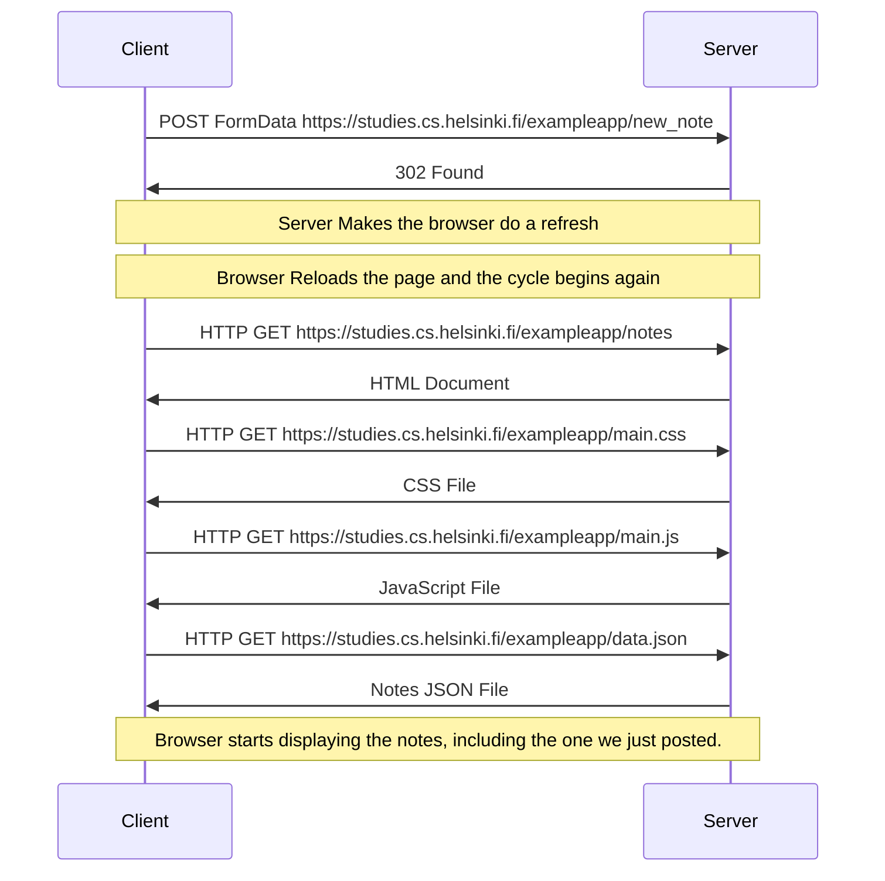

# Explanation
Clients sends the formData in traditional way, server gets the form body and after some validation ( optional step ) it adds the note to the database, then instructs the client ( browser ) to do a reload by using res.redirect() function, the client reloads the webpage and starts sending requests, last request being the javascript in which the code to send another request to the server via AJAX is, this time browser fetches the notes again where our recently added note also exists.
