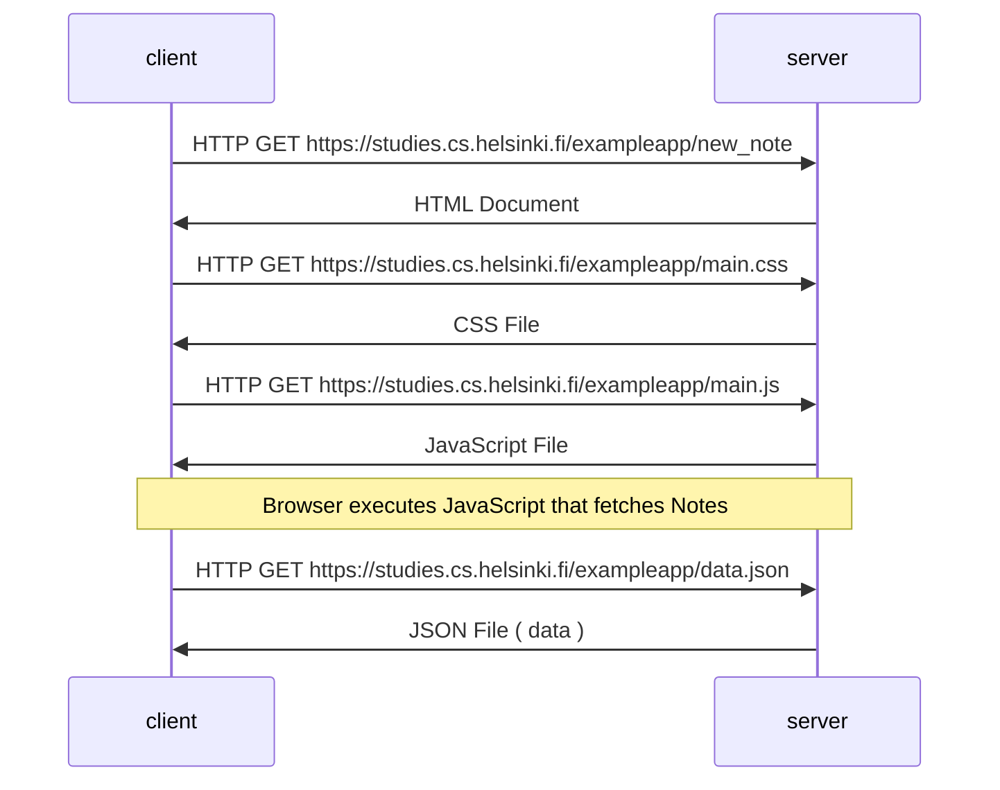

```mermaid
sequenceDiagram
client->>server: HTTP GET https://studies.cs.helsinki.fi/exampleapp/new_note 
server->>client: HTML Document
client->>server: HTTP GET https://studies.cs.helsinki.fi/exampleapp/main.css
server->>client: CSS File
client->>server: HTTP GET https://studies.cs.helsinki.fi/exampleapp/main.js
server->>client: JavaScript File
Note over client,server: Browser executes JavaScript that fetches Notes
client->>server: HTTP GET https://studies.cs.helsinki.fi/exampleapp/data.json
server->>client: JSON File ( data )
```