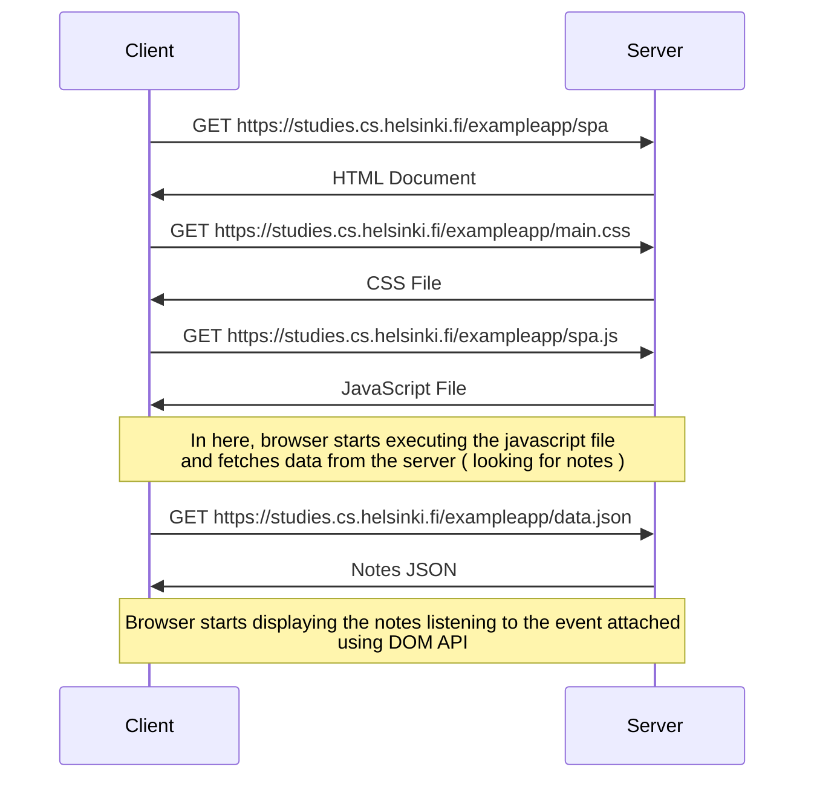

```mermaid
sequenceDiagram
Client->>Server: GET https://studies.cs.helsinki.fi/exampleapp/spa
Server->>Client: HTML Document
Client->>Server: GET https://studies.cs.helsinki.fi/exampleapp/main.css
Server->>Client: CSS File
Client->>Server: GET https://studies.cs.helsinki.fi/exampleapp/spa.js
Server->>Client: JavaScript File
Note over Server,Client: In here, browser starts executing the javascript file<br/> and fetches data from the server ( looking for notes )
Client->>Server: GET https://studies.cs.helsinki.fi/exampleapp/data.json
Server->>Client: Notes JSON
Note over Server,Client: Browser starts displaying the notes listening to the event attached <br/> using DOM API
```