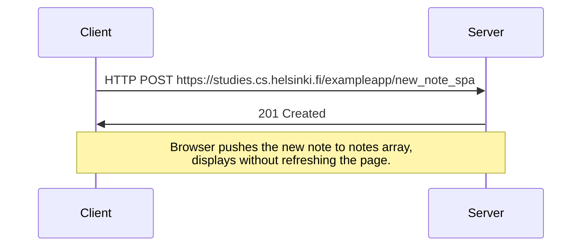

# Explanation
In this Webapp that's trying to resemble SPA applications, the browser is no longer instructed to refresh the page upon adding new notes, instead, it uses fetch api and prevents the default behavior of form submission ( sending FormData using formAction ) and relies on fetch API to post the content and deals with the server response from there, if the response has the status 2XX we know that we've been successful so we just utilize javascript to display notes, no need to refresh the page.