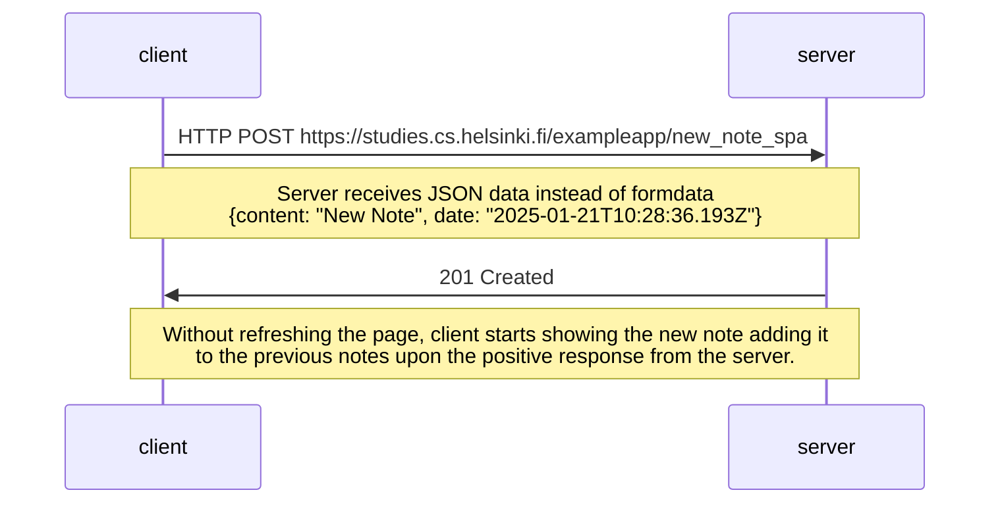

```mermaid
sequenceDiagram
client->>server: HTTP POST https://studies.cs.helsinki.fi/exampleapp/new_note_spa 
Note over client,server: Server receives JSON data instead of formdata<br/> {content: "New Note", date: "2025-01-21T10:28:36.193Z"}
server->>client: 201 Created
Note over client,server: Without refreshing the page, client starts showing the new note adding it <br/> to the previous notes upon the positive response from the server.
```