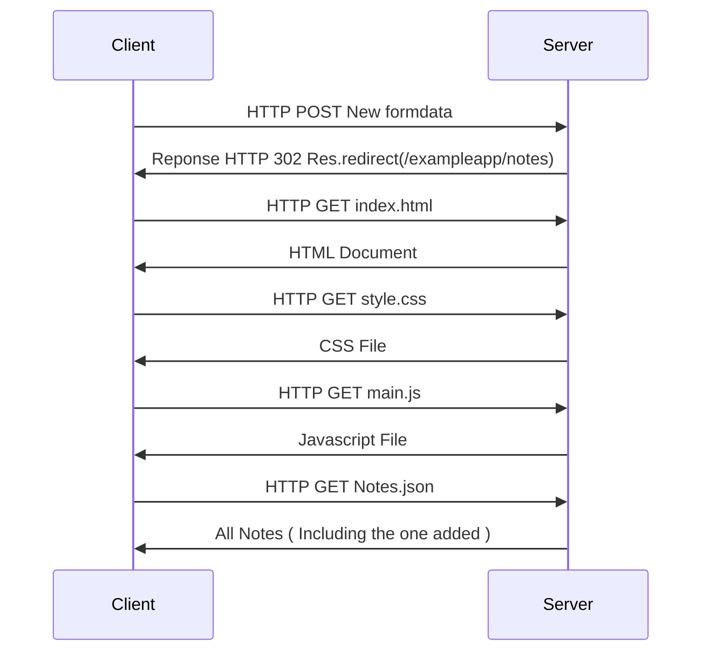

```mermaid
sequenceDiagram
Client->>Server: HTTP POST New formdata
Server->>Client: Reponse HTTP 302 Res.redirect(/exampleapp/notes)
Client->>Server: HTTP GET index.html
Server->>Client: HTML Document
Client->>Server: HTTP GET style.css
Server->>Client: CSS File
Client->>Server: HTTP GET main.js
Server->>Client: Javascript File
Client->>Server: HTTP GET Notes.json
Server->>Client: All Notes ( Including the one added )
```
